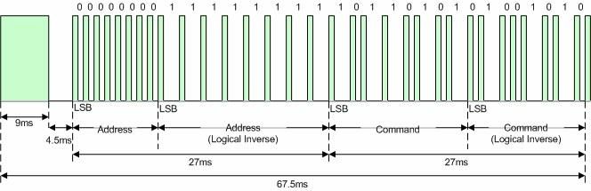
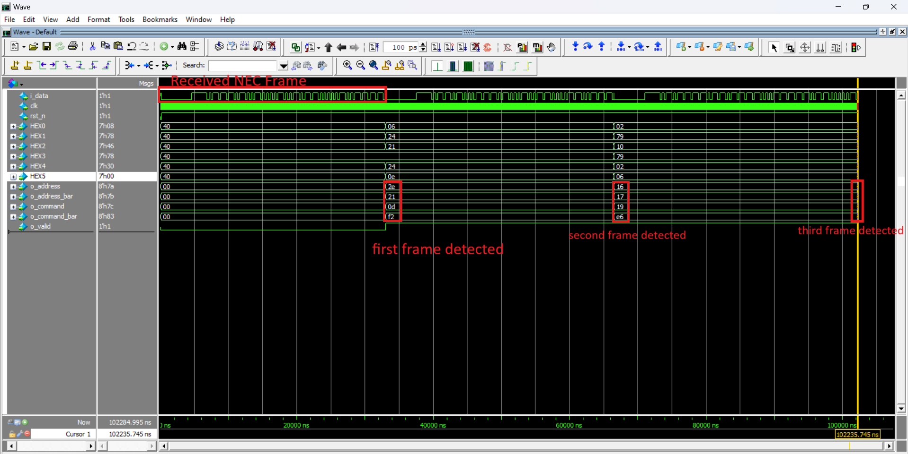
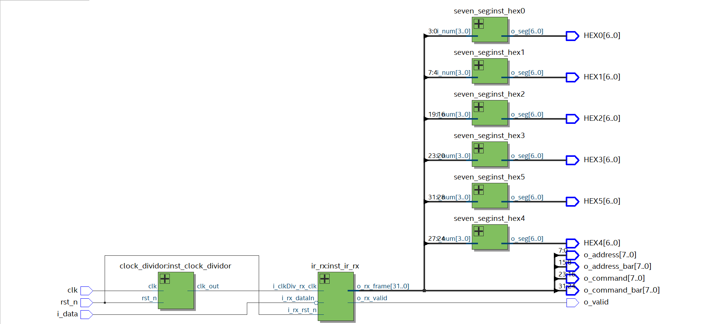

# NEC-IR-Receiver-Implemented-on-DE1_SoC

This project implements an NEC IR transmission protocol receiver on the DE1-SoC development board. The design captures and decodes signals from an IR remote and outputs the received data to seven-segment displays.

## NEC IR Protocol Overview

The NEC IR protocol transmits a message with the following frame structure:

- **9ms leading pulse burst**, followed by a **4.5ms space**.
- **8-bit address**, followed by the **8-bit inverse of the address**.
- **8-bit command**, followed by the **8-bit inverse of the command**.
- **Logical '0'**: 562.5µs pulse + 562.5µs space (1.125ms total per bit).
- **Logical '1'**: 562.5µs pulse + 1.6875ms space (2.25ms total per bit).
- The entire message frame, excluding the final pulse, takes **67.5ms** to transmit.

### Design Flow

The receiver operates with an FSM (Finite State Machine) that moves through various states to decode and validate the transmitted frame:

- **IDLE**: Wait for the start pulse.
- **START_PULSE_CHECK**: Verify the leading 9ms pulse.
- **START_SPACE_CHECK**: Check the 4.5ms space after the start pulse.
- **FRAME_CAPTURE**: Capture the 32 bits of data (address, inverse address, command, inverse command).
- **STOP_PULSE_CHECK**: Verify the final stop pulse to mark the end of the frame.
- **DATA_CHECK**: Ensure the command bits are the inverse of the corresponding inverse command bits.

For a better understanding, refer to the NEC IR frame structure visualized in the [NEC_IR_Protocol.jpg](./screens/NEC_IR_Protocol.jpg) file.

## Project Structure

The main design files and RTL modules can be found in the [`IR_Reciever_Quartus_Proj`](./IR_Reciever_Quartus_Proj) folder, which contains a Quartus project that includes:

- All necessary RTL files for the design.
- Timing constraints meeting setup and hold requirements.
- Testbench file [`tb_TOP_IR_RX.sv`](./TB/tb_TOP_IR_RX.sv) used for simulation and verification.
- Pin assignments for easy interaction with the DE1-SoC board.

The simulation results, including waveforms, can be seen in the [tb_results.png](./screens/tb_results.png) image, which shows the waveform outputs during testing.

## Tools Required

To work with this project, you'll need:
- Intel Quartus Prime.
- ModelSim or QuestaSim for simulation.

## How to Use

1. Open the Quartus project located in the [`IR_Reciever_Quartus_Proj`](./IR_Reciever_Quartus_Proj) folder.
2. Program the DE1-SoC by loading  [`IR_Reciever_Quartus_Proj.sof`](./IR_Reciever_Quartus_Proj/output_files/IR_Reciever_Quartus_Proj.sof)
3. Use any standard NEC IR remote and press any button while pointing it at the IR receiver connected to the DE1-SoC.
4. The decoded address and command will be displayed on the seven-segment displays.

For a demonstration of the design running on the DE1-SoC, see the video [test_design_real_life.mp4](./screens/test_design_real_life.mp4). **Music credit in the video:** Background music is by the Egyptian musician **Hesham Nazih**.

## Visuals

Here are some key visuals for the project:

1. **NEC IR Protocol Frame**: The frame format used in this design is detailed in .
2. **Simulation Results**: Check the waveform simulation from QuestaSim in .
3. **RTL Viewer**: The RTL diagram generated from Quartus is shown in .
4. **Design Demonstration**: Watch the real-life demonstration video where the design runs on DE1-SoC, showing the NEC IR frame being decoded and displayed on the board: .

## Contact

For any questions or support, feel free to reach out:

- **Email:** mohamedniazy972@gmail.com  
- **LinkedIn:** [Mohamed Niazy Hassaneen Ali Mohamed](https://www.linkedin.com/in/mohamed-niazy-2897aa22a/)  
- **Phone:** 01156667615  
